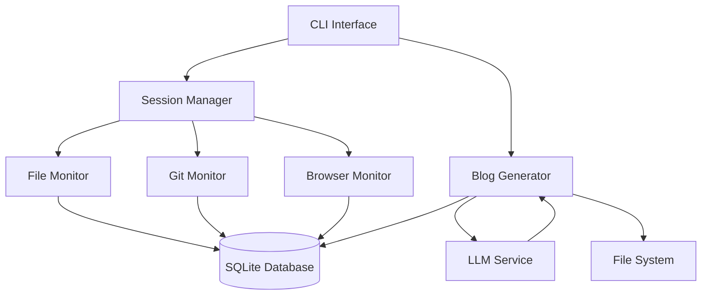

# Design Document

## Overview

StackTrace is a Node.js CLI application that automatically captures developer activity and generates narrative blog posts. The system uses a modular architecture with separate components for monitoring, data storage, and content generation. The design prioritizes simplicity, performance, and local data control.

## Architecture

### High-Level Architecture



### Component Architecture

The application follows a layered architecture:

1. **CLI Layer**: Command interface using Commander.js
2. **Service Layer**: Core business logic (SessionManager, BlogGenerator)
3. **Monitor Layer**: Data collection services (FileMonitor, GitMonitor, BrowserMonitor)
4. **Data Layer**: SQLite database with better-sqlite3
5. **External Layer**: LLM integration via Anthropic SDK

## Components and Interfaces

### CLI Interface (`cli.js`)

**Responsibilities:**
- Parse command line arguments
- Route commands to appropriate services
- Handle user feedback and error display

**Commands:**
- `start [path]` - Initialize tracking session
- `stop` - End current session
- `generate [timeframe]` - Create blog post
- `status` - Display session information

### Session Manager (`services/SessionManager.js`)

**Responsibilities:**
- Manage tracking session lifecycle
- Coordinate monitor services
- Handle session state persistence

**Key Methods:**
```javascript
class SessionManager {
  async startSession(projectPath, options)
  async stopSession()
  async getSessionStatus()
  async isSessionActive()
}
```

### File Monitor (`monitors/FileMonitor.js`)

**Responsibilities:**
- Watch file system changes using chokidar
- Capture snapshots every 30 minutes
- Track active files and modification patterns

**Key Methods:**
```javascript
class FileMonitor {
  async startWatching(projectPath)
  async stopWatching()
  async captureSnapshot()
  async getActiveFiles()
}
```

### Git Monitor (`monitors/GitMonitor.js`)

**Responsibilities:**
- Monitor git repository state using simple-git
- Capture commits, branch changes, and status
- Track git events in real-time

**Key Methods:**
```javascript
class GitMonitor {
  async startMonitoring(projectPath)
  async stopMonitoring()
  async captureGitEvent(eventType, data)
  async getCurrentBranch()
}
```

### Browser Monitor (`monitors/BrowserMonitor.js`)

**Responsibilities:**
- Optional browser history monitoring
- Filter for developer-relevant sites
- Capture documentation and Stack Overflow visits

**Key Methods:**
```javascript
class BrowserMonitor {
  async startMonitoring()
  async stopMonitoring()
  async captureBrowserEvent(url, title, timestamp)
  async filterRelevantSites(historyEntry)
}
```

### Database Manager (`database/DatabaseManager.js`)

**Responsibilities:**
- SQLite database operations
- Schema management and migrations
- Data persistence and retrieval

**Key Methods:**
```javascript
class DatabaseManager {
  async initialize()
  async createSession(projectPath)
  async endSession(sessionId)
  async insertSnapshot(sessionId, files)
  async insertGitEvent(sessionId, event)
  async getTimelineData(timeframe)
}
```

### Blog Generator (`services/BlogGenerator.js`)

**Responsibilities:**
- Retrieve timeline data from database
- Format data for LLM consumption
- Generate narrative blog posts using Anthropic API
- Save generated content to files

**Key Methods:**
```javascript
class BlogGenerator {
  async generateBlogPost(timeframe, options)
  async formatTimelineData(data)
  async callLLMService(prompt, data)
  async saveBlogPost(content, filename)
}
```

## Data Models

### Database Schema

```sql
-- Sessions table
CREATE TABLE sessions (
  id INTEGER PRIMARY KEY AUTOINCREMENT,
  project_path TEXT NOT NULL,
  start_time DATETIME NOT NULL,
  end_time DATETIME,
  status TEXT DEFAULT 'active'
);

-- File snapshots table
CREATE TABLE snapshots (
  id INTEGER PRIMARY KEY AUTOINCREMENT,
  session_id INTEGER NOT NULL,
  timestamp DATETIME NOT NULL,
  file_path TEXT NOT NULL,
  file_size INTEGER,
  last_modified DATETIME,
  change_type TEXT,
  FOREIGN KEY (session_id) REFERENCES sessions(id)
);

-- Git events table
CREATE TABLE git_events (
  id INTEGER PRIMARY KEY AUTOINCREMENT,
  session_id INTEGER NOT NULL,
  timestamp DATETIME NOT NULL,
  event_type TEXT NOT NULL,
  branch_name TEXT,
  commit_hash TEXT,
  commit_message TEXT,
  files_changed TEXT,
  FOREIGN KEY (session_id) REFERENCES sessions(id)
);

-- Browser history table (optional)
CREATE TABLE browser_history (
  id INTEGER PRIMARY KEY AUTOINCREMENT,
  session_id INTEGER NOT NULL,
  timestamp DATETIME NOT NULL,
  url TEXT NOT NULL,
  title TEXT,
  domain TEXT,
  category TEXT,
  FOREIGN KEY (session_id) REFERENCES sessions(id)
);
```

### Data Transfer Objects

```javascript
// Session data structure
const SessionData = {
  id: Number,
  projectPath: String,
  startTime: Date,
  endTime: Date,
  status: String
};

// Snapshot data structure
const SnapshotData = {
  sessionId: Number,
  timestamp: Date,
  files: [{
    path: String,
    size: Number,
    lastModified: Date,
    changeType: String
  }]
};

// Git event data structure
const GitEventData = {
  sessionId: Number,
  timestamp: Date,
  eventType: String,
  branchName: String,
  commitHash: String,
  commitMessage: String,
  filesChanged: Array
};
```

## Error Handling

### Error Categories

1. **File System Errors**: Handle permission issues, missing directories, and file access problems
2. **Database Errors**: Manage connection failures, schema issues, and transaction problems
3. **Git Errors**: Handle non-git directories, permission issues, and git command failures
4. **LLM Service Errors**: Manage API failures, rate limits, and network issues
5. **CLI Errors**: Handle invalid commands, missing parameters, and user input validation

### Error Handling Strategy

```javascript
// Centralized error handling
class ErrorHandler {
  static handle(error, context) {
    switch (error.type) {
      case 'FILE_SYSTEM_ERROR':
        return this.handleFileSystemError(error, context);
      case 'DATABASE_ERROR':
        return this.handleDatabaseError(error, context);
      case 'GIT_ERROR':
        return this.handleGitError(error, context);
      case 'LLM_SERVICE_ERROR':
        return this.handleLLMError(error, context);
      default:
        return this.handleGenericError(error, context);
    }
  }
}
```

### Graceful Degradation

- File monitoring continues even if git monitoring fails
- Browser monitoring is optional and doesn't block core functionality
- Blog generation works with partial data if some monitors fail
- Database operations use transactions to maintain consistency

## Testing Strategy

### Unit Testing

- Test individual components in isolation
- Mock external dependencies (file system, git, LLM API)
- Focus on core business logic and data transformations
- Use Jest or similar testing framework

### Integration Testing

- Test component interactions
- Use temporary directories and test databases
- Verify end-to-end workflows
- Test CLI commands with real file system operations

### Test Structure

```
tests/
├── unit/
│   ├── services/
│   ├── monitors/
│   └── database/
├── integration/
│   ├── cli.test.js
│   ├── session-workflow.test.js
│   └── blog-generation.test.js
└── fixtures/
    ├── sample-project/
    └── test-data.json
```

### Performance Considerations

- File monitoring uses efficient chokidar watchers
- Database operations are batched for snapshots
- LLM calls are rate-limited and cached when possible
- Memory usage is monitored for long-running sessions

### Security Considerations

- All data stored locally in SQLite database
- No sensitive information sent to external services
- Browser history filtering to exclude private browsing
- File path validation to prevent directory traversal
- API key management for LLM services